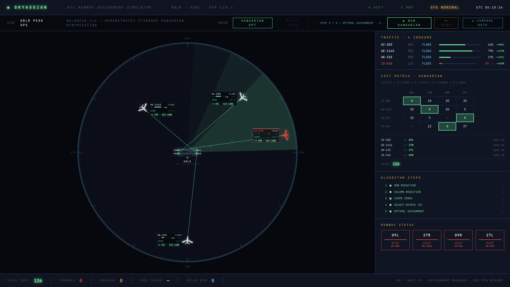

<div align="center">

# ✈ SkyAssign

### Optimal air traffic control runway assignment — solved with the Hungarian Algorithm

*Same four aircraft. Same fuel gauges. Same runways. One algorithm crashes a plane. The other lands them all.*



</div>

---

## What this is

An Operations Research mini-project that turned into something else.

Four aircraft are on final approach to Kempegowda International Airport, Bengaluru. One of them — IX-543, an Air India Express regional jet — is at 8% fuel. Somewhere in the next four minutes, a decision has to be made about which plane lands on which runway. Get it wrong and IX-543 runs out of fuel before it reaches the threshold. Get it right and everyone walks off the jetbridge into the terminal.

The math behind that decision is the **Assignment Problem** — Unit IV of the Operations Research syllabus at JSS STU — and the algorithm that solves it optimally, in polynomial time, is the **Hungarian Algorithm** (Kuhn, 1955, standing on Kőnig's 1931 bipartite-graph work).

SkyAssign implements it from scratch. No solver libraries. No shortcuts. Every one of the five reduction steps executes on screen, in real time, next to a live radar scope showing the actual planes it's routing.

## The wow moment

The `[⇄ COMPARE BOTH]` button runs the same input scenario through two algorithms back-to-back:

- **NAIVE FCFS (first-come-first-served)** — the greedy heuristic that human intuition suggests. Assigns whichever aircraft is closest first, then whichever's next-closest, and so on. IX-543 isn't closest, so it gets last pick of runways — and last pick is too far for 8% fuel. **CRASH.** System status flips to EMERGENCY.
- **HUNGARIAN OPTIMAL** — same cost matrix, but solves it globally instead of greedily. IX-543 gets 09R. Everyone lands. TOTAL COST 126. CRASHES 0.

Same input, same runways, same fuel numbers. Different algorithm, different outcome, different consequence for the passengers on IX-543. That's what Operations Research is *for.*

## The cost function

Every cell C[i][j] of the cost matrix is a weighted composite of four operational concerns:

```
C[i][j]  =  0.4 · fuelRisk(i)                ← safety dominates
         +  0.3 · approachDistance(i,j)      ← efficiency
         +  0.2 · runwayIncompatibility(i,j) ← infrastructure
         +  0.1 · gatePenalty(i,j)           ← commercial preference
```

Weights are explicit, tunable, and defensible. Fuel gets the largest weight because in ATC nothing outranks the aircraft that might not make it.

## The algorithm

Five steps, implemented from first principles in `src/lib/hungarian/hungarian.ts`, zero external dependencies:

1. **Row Reduction** — subtract each row's minimum from that row
2. **Column Reduction** — same, for columns
3. **Cover All Zeros** — minimum-line cover, computed via König's theorem (augmenting-path matching, not the naive "line through the most zeros" heuristic every intro textbook fails at)
4. **Adjust Matrix** — subtract smallest uncovered value from uncovered cells, add to double-covered intersections, loop back to Step 3
5. **Optimal Assignment** — extract the zeros

Terminates in O(n³). Brute force would be O(n!), which for n=15 is 1.3 trillion permutations. This is why the algorithm matters.

## Verification

The algorithm is proven correct against a 5×5 minimisation test case (TC1) in three independent ways:

1. **Hand solution** — the full step-by-step reduction is worked out by hand and matches the implementation's step trace exactly
2. **Brute-force cross-validator** — all 5! = 120 permutations are enumerated and their costs computed; the true minimum is 35, and Hungarian reports 35
3. **Six-case test suite, 34/34 passing** — balanced, unbalanced (both directions), maximisation, degeneracy

The brute-force cross-validator lives in the test suite. It's mathematically the strongest possible correctness check: every possible assignment is considered, and any bug would produce a discrepancy.

## Tech

- **Next.js 16** (App Router) + **TypeScript**
- **Tailwind CSS v4** with a custom aerospace palette (scope-green, amber HUD, warning red on deep navy)
- **Framer Motion** for the radar sweep, matrix cell transitions, and Step 5 assignment vectors
- **Pure SVG** — every aircraft silhouette, every runway strip, every range ring. No raster. No 3D. No engine.
- **Zero solver dependencies** — the Hungarian implementation is hand-written and every line is defensible in viva

## Run it

```bash
git clone https://github.com/meisamith/skyassign.git
cd skyassign
npm install
npm run dev
```

Open http://localhost:3000. Click `[▶ RUN HUNGARIAN]` to watch the matrix transform through all five steps in sequence. Click `[⏭ STEP]` to step through manually. Click `[⇄ COMPARE BOTH]` for the naive-vs-optimal side by side.

## Run the tests

```bash
npx tsx --test src/lib/hungarian/hungarian.test.ts
```

Expected: `34/34 passing`.

## Structure

```
src/
├── lib/
│   ├── hungarian/
│   │   ├── hungarian.ts      ← the algorithm, pure functions
│   │   ├── cost-matrix.ts    ← C[i][j] composite cost construction
│   │   └── hungarian.test.ts ← 6 cases, 34 assertions
│   └── naive/
│       └── naive-fcfs.ts     ← the greedy foil
├── components/
│   ├── radar/                ← RadarScope, AnimatedRadarScope, aircraft SVG
│   ├── hud/                  ← MatrixPanel, TrafficRoster, SystemClock
│   └── controls/             ← RunControls (RUN, STEP, COMPARE BOTH)
├── simulation/
│   ├── scenarios.ts          ← KBLR_PEAK
│   └── types.ts              ← Aircraft, Runway, Scenario
└── app/                      ← Next.js App Router entry
```

## References

The theoretical foundation:

- Kuhn, H. W. (1955). *The Hungarian method for the assignment problem.* Naval Research Logistics Quarterly, 2(1–2), 83–97.
- Kőnig, D. (1931). *Gráfok és mátrixok.* Matematikai és Fizikai Lapok, 38, 116–119.
- Sharma, J. K. (2017). *Operations Research: Theory and Applications* (6th ed.), Chapter 11 — Assignment Problem.
- Taha, H. A. (2017). *Operations Research: An Introduction* (10th ed.), Section 5.4.

---


MIT License · © 2026 
